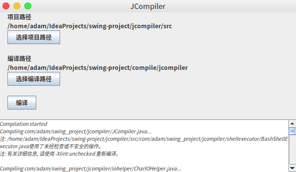
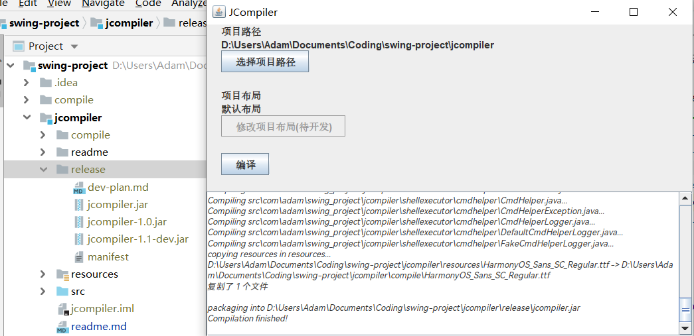

## 基于Swing的Java编译器
- 1.0版本 基础功能 
  可指定源代码目录、输出目录执行编译 
  支持Linux/Windows 
  本地测试通过 
  
- 1.1版本 支持项目布局 
  可使用默认布局，即 
  --            根目录 
  ----src       源代码 
  ----resources 资源目录 
  使源代码和资源目录一同构建。 
  