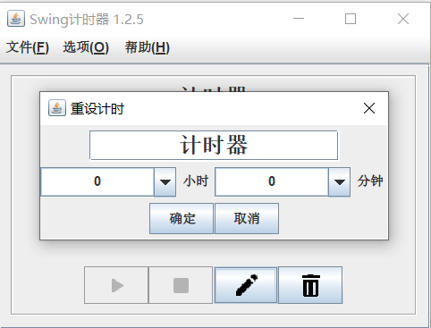
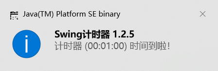
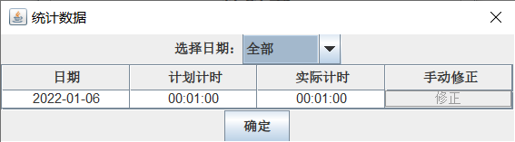
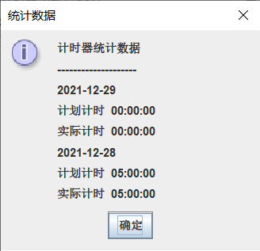
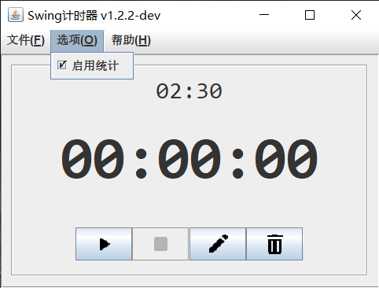
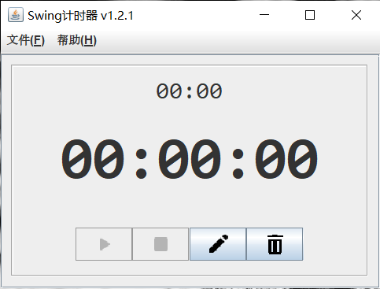
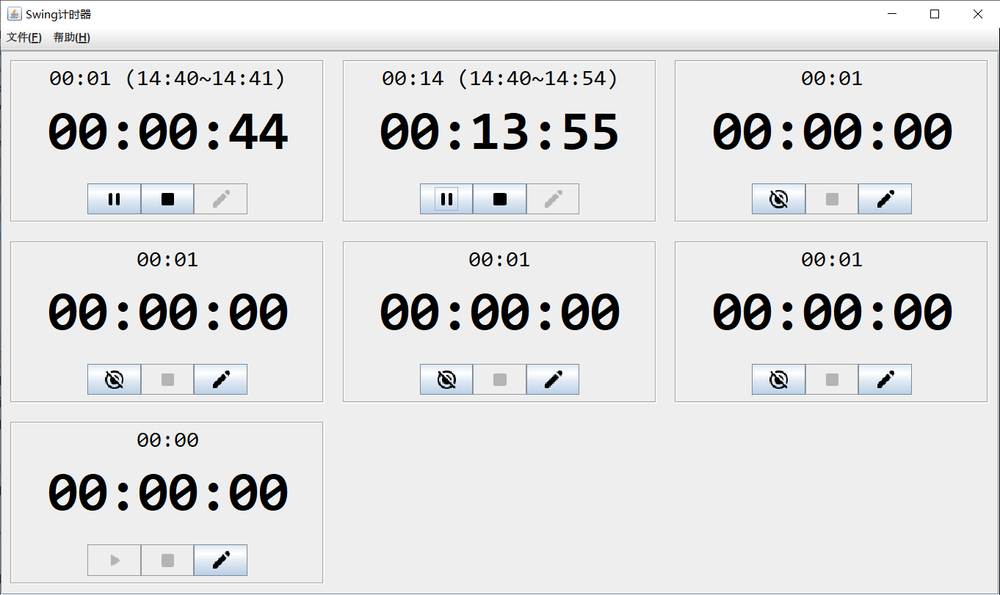
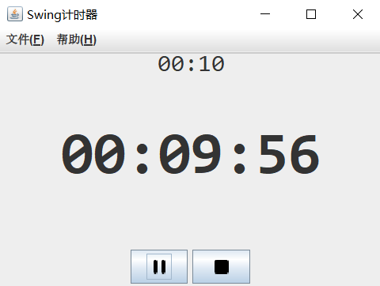
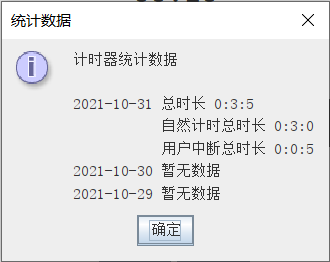
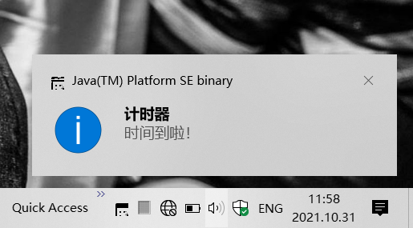

# timer

------------
基于Swing开发的计时器，具备统计功能，Windows10&Ubuntu18测试通过 

## v1.2版本
结束程序时可记录状态，在下一次启动时可恢复到先前的状态。

### 1.2.5版本
1. 启动时清理持久化文件；
2. 统计对话框以表格形式展现，可以手动修正数据；
3. 计时器编辑对话框布局优化；
4. 改进的通知文本；
5. 修复多计时器的异常问题。

### 1.2.4版本
重构计时器代码；基于ActionLog的统计功能；暂时去除统计功能开关 

### 1.2.3版本
优化代码，通过loader构建jar包
### 1.2.2版本
统计功能开关 

### 1.2.1版本
增加了删除按钮 

## v1.1版本
支持多个计时器同时运行；优化了计时代码。 

## v1.0版本
- 支持设置一个计时器，最大计时24小时，最小粒度支持到分钟
- 开始计时后，展示“时分秒”格式的剩余时间
- 计时完成时，向通知中心发出通知并播放通知声音
- 支持暂停和重置功能
- 支持后台运行，可收起到任务栏托盘图标
- 支持每日汇总统计 
  
  
  