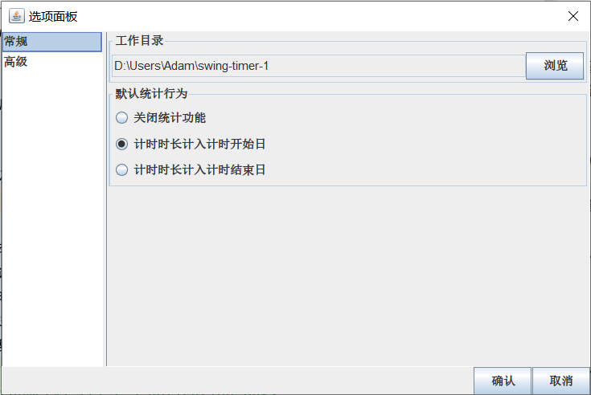
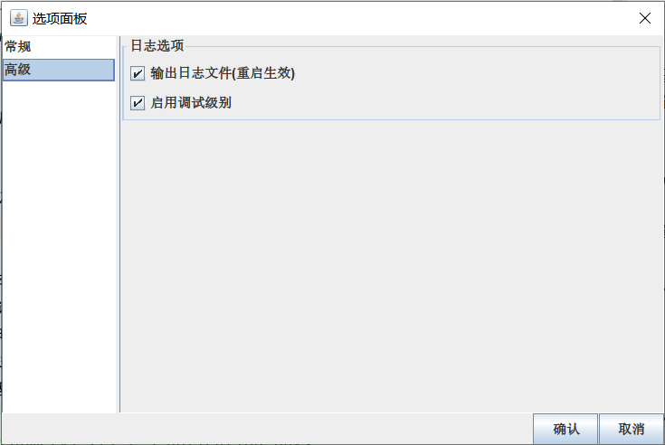
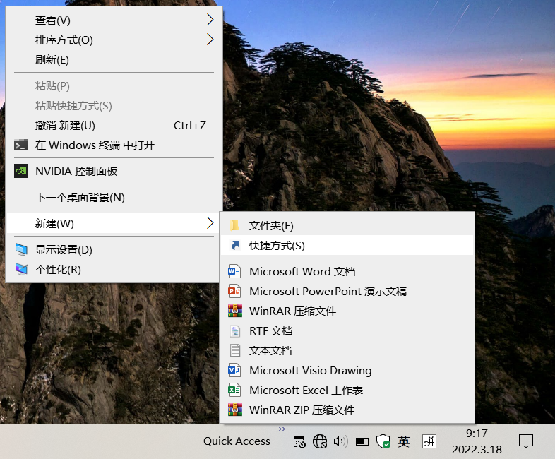
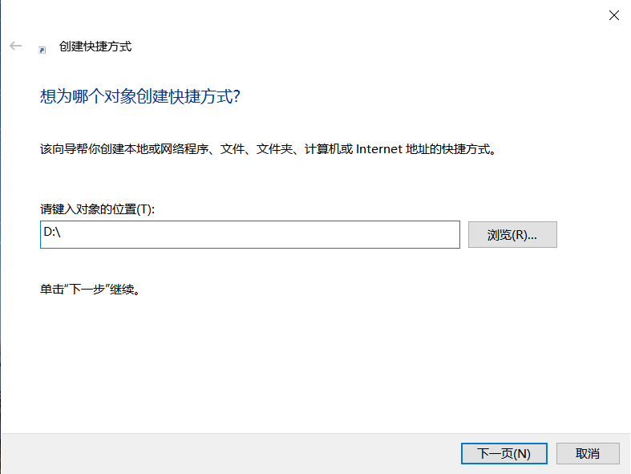
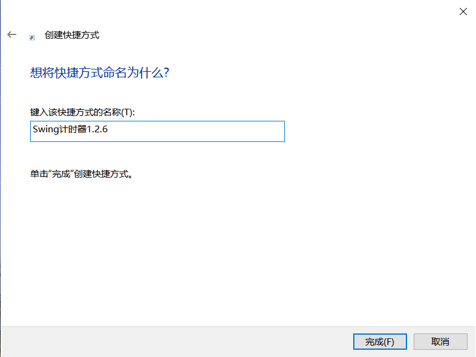
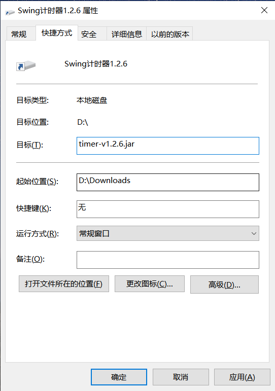

# timer

------------
基于Swing开发的计时器，具备统计功能，Windows10&Ubuntu18测试通过 

## v1.2版本
结束程序时可记录状态，在下一次启动时可恢复到先前的状态。

### 1.2.6版本（当前版本）
1. 引入选项面板，可以调整工作目录、默认统计行为、日志选项；（由于日志类不支持切换目录，切换工作目录后日志文件暂时不能自动迁移）
2. 默认统计行为，可选项：
   - 关闭统计功能：计时器计时数据不计入到统计数据中，但是之前的统计数据不会消失
   - 计时时长计入计时开始日：计时器计时结束时，将计时数据统计到计时开始日
   - 计时时长计入计时结束日：计时器计时结束时，将计时数据统计到计时结束
3. 日志选项，可选项：
   - 输出日志文件：开启后，在工作目录输出日志文件
   - 启用调试级别：开发者功能，向日志文件输出调试级别日志
4. 序列化代码完善。

#### Windows快捷方式配置
1.2.6版本使得日志可输出到文件中，因此可以忽略控制台输出。在Windows中可配置快捷方式启动程序： 
1. 在桌面右键创建快捷方式，对象的位置随便指定一个目录即可，对象的名称可输入“Swing计时器1.2.6”；
2. 在建好的快捷方式上右键-属性，选择快捷方式选项卡，在起始位置中输入发行版jar包的下载位置（如：D:\Downloads），在目标中输入"timer-v1.2.6.jar"；
3. 双击快捷方式即可启动程序。

### 1.2.5版本
1. 启动时清理持久化文件；
2. 统计对话框以表格形式展现，可以手动修正数据；
3. 计时器编辑对话框布局优化；
4. 改进的通知文本；
5. 修复多计时器的异常问题。

### 1.2.4版本
重构计时器代码；基于ActionLog的统计功能；暂时去除统计功能开关 

### 1.2.3版本
优化代码，通过loader构建jar包
### 1.2.2版本
统计功能开关 

### 1.2.1版本
增加了删除按钮 

## v1.1版本
支持多个计时器同时运行；优化了计时代码。 

## v1.0版本
- 支持设置一个计时器，最大计时24小时，最小粒度支持到分钟
- 开始计时后，展示“时分秒”格式的剩余时间
- 计时完成时，向通知中心发出通知并播放通知声音
- 支持暂停和重置功能
- 支持后台运行，可收起到任务栏托盘图标
- 支持每日汇总统计 
  
  
  