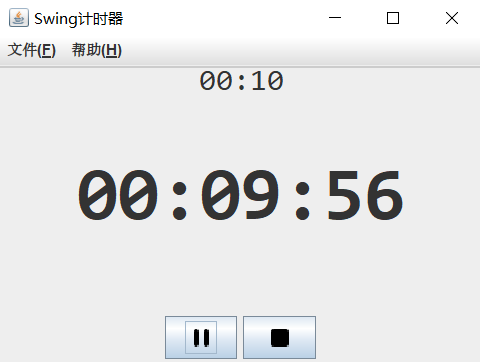
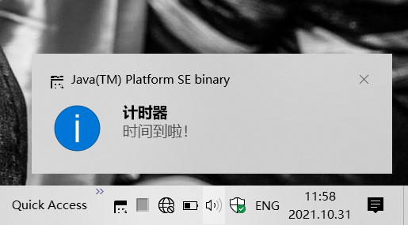

## 基于Swing的计时器 v1.0

------
简介：基于Swing开发的计时器，具备统计功能，Windows10&Ubuntu18测试通过 
- 支持设置一个计时器，最大计时24小时，最小粒度支持到分钟
- 开始计时后，展示“时分秒”格式的剩余时间
- 计时完成时，向通知中心发出通知并播放通知声音
- 支持暂停和重置功能
- 支持后台运行，可收起到任务栏托盘图标
- 支持每日汇总统计 

